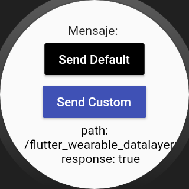
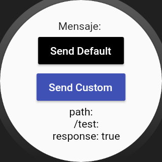
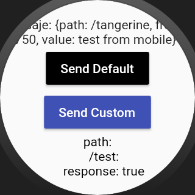

# wearable_data_layer (Android Only)

A Flutter plugin to send and receive messages on wearable([Data-Layer](https://developer.android.com/training/wearables/data-layer/messages.html)).

Note: This plugin is still under development.

<div style="display:flex;flex-direction:row;">
    
    
    
</div>

### To use
#### Android

In the file `android/app/build.gradle` on dependencies block, add the follow code:

```gradle
// wearable libraries
    implementation 'com.android.support:wear:26.1.0'
    implementation 'com.google.android.gms:play-services-wearable:12.0.1'
    compileOnly 'com.google.android.wearable:wearable:2.2.0'
    implementation 'com.google.android.support:wearable:2.2.0'
```

Android app to mobile devices and Android app to wearable should have the same `applicationId`.

Thanks
------

**Denny Segura** © 2019+, Released under the [MIT License].<br>

> GitHub [@devdennysegura](https://github.com/devdennysegura) &nbsp;&middot;&nbsp;
> Twitter [@dennysegura3](https://twitter.com/dennysegura3)

[MIT License]: http://mit-license.org/
